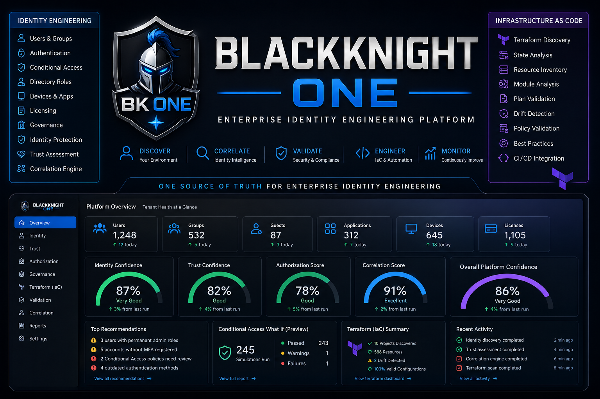

<p align="center">
  
</p>

# BLACKKNIGHT ONE

## Enterprise Identity Engineering Platform

# One Source of Truth for Enterprise Identity Engineering

Blackknight One is an open-source platform designed to help organizations **discover, correlate, validate, understand, and automate** Microsoft Entra environments through Microsoft Graph, Infrastructure as Code, and engineering-driven workflows.

---

# Modern identity isn't simply administered.

**Modern identity is engineered.**

Today's Microsoft Entra environments extend far beyond users and groups. They include Conditional Access, Identity Governance, authentication methods, administrative roles, Infrastructure as Code, CI/CD pipelines, service principals, applications, and automation.

Managing these workloads independently creates fragmented visibility and inconsistent engineering practices.

Blackknight One exists to unify these domains into a single engineering platform.

Our vision is simple.

> **One Source of Truth for Enterprise Identity Engineering**

---

# Our North Star

Enterprise identity has become the control plane for modern organizations.

As environments continue to grow across Microsoft Entra, Microsoft 365, Infrastructure as Code, and DevSecOps pipelines, identity information becomes fragmented across portals, APIs, scripts, repositories, and operational tooling.

Blackknight One brings those worlds together.

Every service, engine, report, and dashboard is designed to move organizations closer to a single engineering truth.

Our mission is to make Enterprise Identity Engineering:

- Measurable
- Repeatable
- Validatable
- Automatable

---

# The Five Engineering Pillars

Everything inside Blackknight One aligns to five engineering principles.

```text
Discover
      │
      ▼
Correlate
      │
      ▼
Validate
      │
      ▼
Understand
      │
      ▼
Automate
```

## Discover

Collect authoritative information from supported platforms.

Examples include:

- Microsoft Entra ID
- Microsoft Graph
- Microsoft 365
- Terraform (planned)

---

## Correlate

Relationships create intelligence.

Blackknight One correlates identities, authentication, authorization, licensing, governance, and infrastructure to provide operational context.

---

## Validate

Engineering requires validation.

Blackknight One validates:

- Identity
- Trust
- Configuration
- Platform Health
- Infrastructure as Code
- CI/CD (planned)

---

## Understand

Raw inventory has limited value.

Blackknight One transforms collected information into:

- Confidence Scores
- Identity Intelligence
- Recommendations
- Operational Insights
- Drift Detection (planned)

---

## Automate

Engineering should be repeatable.

Blackknight One is designed to integrate with:

- Microsoft Graph
- PowerShell
- Terraform
- GitHub Actions (planned)
- Azure DevOps (planned)
- REST APIs (planned)

---

# Platform Architecture

Blackknight One follows a layered architecture.

```text
                    BLACKKNIGHT ONE
        Enterprise Identity Engineering Platform

                  External Data Sources
────────────────────────────────────────────────────

 Microsoft Graph      Terraform      Future Providers

            │              │               │
            └──────────────┼───────────────┘
                           │

                  Discovery Services

      Users
      Groups
      Domains
      Licensing
      Conditional Access
      Authentication
      Directory Roles

                           │

                   Platform Services

      Logging
      Validation
      Reporting
      Configuration
      Service Registry
      Engine Registry

                           │

                 Assessment Engines

      Identity
      Trust
      Correlation
      Governance (planned)
      Operations (planned)
      Terraform (planned)

                           │

                 Correlation Layer

      Identity Graph
      Administrative Exposure
      Recommendations

                           │

                  Confidence Engine

      Identity
      Trust
      Governance
      Operations
      Validation

                           │

                 Experience Layer

      Dashboard
      JSON Reports
      Power BI (planned)
      REST API (planned)
```

---

# Current Capabilities

Current platform capabilities include:

- Microsoft Graph Discovery
- Tenant Discovery
- User Inventory
- Group Inventory
- Domain Inventory
- Licensing Inventory
- Conditional Access Discovery
- Named Locations
- Authentication Method Analysis
- MFA Registration Analysis
- Passwordless Readiness
- SSPR Readiness
- Directory Role Analysis
- Identity Correlation
- Identity Graph
- Trust Assessment
- Confidence Scoring
- Platform Dashboard
- JSON Reporting
- Platform Validation

---

# Current Assessment Engines

| Engine | Status |
|---------|--------|
| Identity | Available |
| Trust | Available |
| Correlation | Available |
| Validation | In Development |
| Governance | Planned |
| Operations | Planned |
| Terraform | Planned |

---

# Documentation

Blackknight One documentation is organized into three major areas.

## Learn

New to the platform?

Start here.

- Getting Started
- Installation
- Quick Start
- Platform Overview
- Platform Architecture
- Command Reference

📁 `docs/Learn`

---

## Build

Interested in extending the platform?

Learn how Blackknight One is engineered.

Topics include:

- Platform
- Services
- Schemas
- Terraform
- Development
- Registries

📁 `docs/Build`

---

## Operate

Using Blackknight One in production?

Explore:

- Concepts
- Engines
- Examples
- Governance
- Security
- Trust
- Roadmap

📁 `docs/Operate`

---

# Quick Start

```powershell
Import-Module .\scripts\PowerShell\Platform\Blackknight-Platform.psm1 -Force

Test-BKPlatform

Connect-BKGraph

Get-BKTenant

.\scripts\PowerShell\Identity\Invoke-BKIdentityDiscovery.ps1

.\scripts\PowerShell\Trust\Invoke-BKTrustDiscovery.ps1

.\scripts\PowerShell\Correlation\Invoke-BKCorrelation.ps1

Show-BKDashboard
```

Within minutes you'll have:

- Tenant Inventory
- Identity Inventory
- Trust Assessment
- Directory Role Analysis
- Identity Correlation
- Confidence Scores
- Recommendations
- Dashboard
- JSON Reports

---

# Engineering Principles

Blackknight One follows several guiding principles.

- Evidence over assumptions.
- Correlation over isolated reporting.
- Validation before deployment.
- Infrastructure as Code by design.
- Automation as the default.
- Modular architecture.
- Reusable services.
- Open engineering standards.
- Confidence through measurable evidence.

These principles guide every new feature, service, and assessment engine.

---

# Roadmap

## v0.5.x

- Identity Discovery
- Trust Discovery
- Correlation Engine
- Dashboard
- Confidence Scoring
- Platform Validation

---

## v0.6.x

- Terraform Discovery
- Terraform State Analysis
- Identity as Code
- CI/CD Validation
- Conditional Access Simulation
- Drift Detection

---

## v0.7.x

- REST API
- Plugin Framework
- HTML Reports
- Power BI Integration
- Historical Trending
- Multi-Tenant Assessments
- GDAP Optimization

---

# Why Blackknight One?

Traditional tools answer questions like:

> What exists?

Blackknight One goes further.

It helps answer:

- Why does it matter?
- What changed?
- What is at risk?
- How confident are we?
- What should we improve next?
- How do we validate changes before production?

That shift—from inventory to engineering intelligence—is what defines Blackknight One.

---

# Contributing

Contributions are welcome.

Whether you're improving documentation, building assessment engines, enhancing Terraform support, or expanding identity intelligence, every contribution helps move the platform closer to its North Star.

Please review the documentation in **docs/Build** before contributing.

---

# License

This project is licensed under the MIT License.

---

# The Journey

Blackknight One is more than a collection of PowerShell modules.

It is a long-term effort to build an open, extensible platform for Enterprise Identity Engineering—one that helps organizations confidently discover, correlate, validate, understand, and automate their identity environments.

Every release moves us closer to our North Star.

# One Source of Truth for Enterprise Identity Engineering