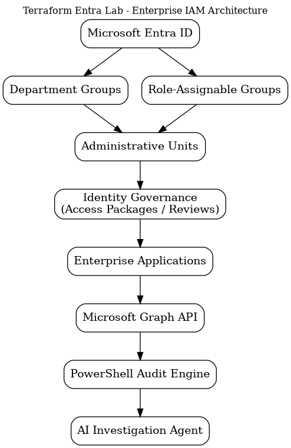

# Terraform Entra Lab

Enterprise Infrastructure as Code (IaC) project focused on designing, deploying, and auditing Microsoft Entra ID environments using Terraform, Microsoft Graph, PowerShell, and AI-assisted automation.

This project is being developed as a real-world Identity and Access Management (IAM) engineering portfolio demonstrating enterprise identity architecture, automation, governance, and security best practices.

---

# Project Objectives

- Deploy Microsoft Entra ID infrastructure using Terraform
- Implement enterprise IAM architecture and governance
- Design scalable Role-Based Access Control (RBAC) models
- Build Identity Governance solutions using Access Packages and Administrative Units
- Develop Conditional Access and Zero Trust security configurations
- Automate identity auditing with Microsoft Graph and PowerShell
- Integrate AI-assisted investigation and reporting workflows
- Demonstrate modern Infrastructure as Code engineering practices

---

# Current Features

## Identity Foundation

- Microsoft Entra ID Provider
- Azure CLI Authentication
- Environment-aware Terraform deployments
- Reusable Infrastructure as Code architecture

## Identity Architecture

- Department-based Security Groups
- Role-Assignable Groups
- Environment-specific naming conventions
- Stable Terraform state management

## Documentation

- IAM Design Documentation
- Access Package Planning
- Conditional Access Design
- Terraform Workflow
- Security Audit Strategy
- Project Roadmap

---

# Architecture



---

# Repository Structure

```text
terraform-entra-lab

── docs/                # Design documentation
── terraform/           # Infrastructure as Code
── scripts/             # PowerShell & Microsoft Graph automation
── modules/             # Reusable Terraform modules
── examples/            # Example deployment scenarios
── images/              # Architecture diagrams
── releases/            # Release notes
── CHANGELOG.md
── README.md
```

---

# Technology Stack

## Identity Platforms

- Microsoft Entra ID
- Microsoft Graph
- Azure Active Directory

## Infrastructure as Code

- Terraform
- Azure CLI

## Automation

- PowerShell
- Git
- GitHub

## Security

- Conditional Access
- Identity Governance
- Role-Based Access Control (RBAC)
- Administrative Units
- Access Packages

## Future Integrations

- Privileged Identity Management (PIM)
- Microsoft Graph SDK
- GitHub Actions
- CI/CD Pipelines
- AI Investigation Agent
- Automated Security Auditing

---

# Project Roadmap

## ✅ v0.1.0 — Foundation Release

- GitHub Repository
- Terraform Project
- Microsoft Entra Provider
- Department Security Groups
- Documentation

## ✅ v0.2.0 — Identity Architecture

- Environment-aware Deployments
- Role-Assignable Groups
- Naming Standards
- Stable Terraform State

## 🚧 v0.3.0 — Identity Governance

- Administrative Units
- Dynamic Groups
- Identity Relationships
- User Lifecycle Management

## 🔜 v0.4.0 — Conditional Access Framework

- Named Locations
- Authentication Strengths
- Session Controls
- Zero Trust Policies

## 🔜 v0.5.0 — Enterprise Applications

- Enterprise Applications
- Service Principals
- RBAC Assignments
- Application Roles

## 🔜 v0.6.0 — Microsoft Graph Automation

- Microsoft Graph SDK
- Automated Security Audits
- Identity Reporting
- Compliance Validation

## 🔜 v1.0.0 — Enterprise IAM Engineering Lab

A fully automated Microsoft Entra ID engineering environment demonstrating enterprise identity architecture, governance, automation, security auditing, and AI-assisted investigation workflows.

---

# Why This Project?

Modern Identity and Access Management extends beyond user and group administration. Enterprise IAM Engineers design secure, automated, and scalable identity platforms that integrate governance, least privilege, Zero Trust principles, and Infrastructure as Code.

This project serves as a continuously evolving engineering portfolio demonstrating those capabilities through real Microsoft Entra ID deployments and automation.

---

# Author

**Todd Crow**

Senior Microsoft 365 / Microsoft Entra Engineer

Colorado Springs, Colorado

GitHub: https://github.com/TekPanda211